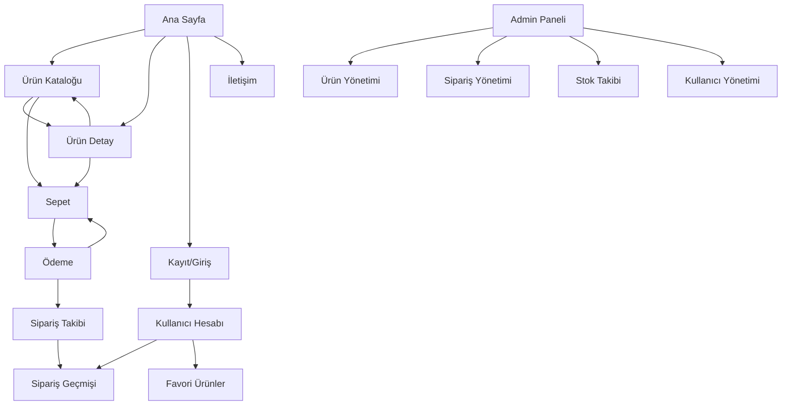

## 1. Product Overview
Lilyum Flora, kullanıcıların taze çiçekler, aranjmanlar ve özel gün çiçeklerini kolayca satın alabileceği modern bir e-ticaret platformudur. Müşterilerine hızlı teslimat, geniş ürün yelpazesi ve güvenli ödeme imkanı sunarak çiçek satın alma deneyimini dijitalleştirir ve erişilebilir hale getirir.

### 1.1 Pazar Analizi ve Rekabet Avantajları

#### Ana Rakipler
- **Çiçeksepeti**: Türkiye'nin en büyük çiçekçi platformu, geniş dağıtım ağı ve aynı gün teslimat imkanı sunuyor. Ürün yelpazesini çiçeklerin ötesine genişletmiş (elektronik, moda, kozmetik gibi).<mcreference link="https://www.ciceksepeti.com" index="1">1</mcreference>
- **Tazecicek.com**: 90 dakikada teslimat özelliği ile öne çıkıyor, indirimli ürünler ve hızlı teslimat seçenekleri sunuyor.<mcreference link="https://www.tazecicek.com/" index="2">2</mcreference>
- **ÇiçekFilosu**: Türkiye Çiçekçiler Birliği güvencesi ile hizmet veriyor, yerel çiçekçi ustaları ile çalışıyor.<mcreference link="https://www.cicekfilosu.com/" index="3">3</mcreference>
- **Osevio**: Mobil uyumlu arayüz ve uygulama ile öne çıkıyor, kalite ve tazelik garantisi sunuyor.<mcreference link="https://www.osevio.com/" index="4">4</mcreference>
- **ÇiçekNet**: Türkiye'de ilk medya mesaj (video, ses, resim) ile çiçek gönderimi hizmeti sunuyor.<mcreference link="https://www.ciceknet.com/" index="5">5</mcreference>

#### Rekabet Analizi Tablosu
| Özellik | Çiçeksepeti | Tazecicek | ÇiçekFilosu | Osevio | ÇiçekNet | Lilyum Flora |
|---------|-------------|-----------|-------------|---------|----------|--------------|
| Aynı Gün Teslimat | ✅ | ✅ (90 dk) | ✅ | ✅ | ✅ | ✅ |
| Mobil Uygulama | ✅ | ❌ | ❌ | ✅ | ❌ | ❌ (öncelik mobil web) |
| Medya Mesajı | ❌ | ❌ | ❌ | ❌ | ✅ | ✅ |
| Gift Finder | ✅ | ❌ | ❌ | ❌ | ❌ | ✅ |
| Görsel Doğrulama | ✅ | ❌ | ❌ | ❌ | ❌ | ✅ |
| Reminder Sistemi | ✅ | ❌ | ❌ | ❌ | ❌ | ✅ |
| Butik Tasarım | ❌ | ✅ | ✅ | ✅ | ✅ | ✅ |
| Geniş Ürün Yelpazesi | ✅ (Extra ile) | ✅ | ✅ | ✅ | ✅ | ✅ (odaklı) |

#### Lilyum Flora'nın Rekabet Avantajları
1. **Butik ve Kişisel Çiçekçilik**: Büyük pazaryeri yaklaşımı yerine, her bir sipariş için özenle hazırlanan butik çiçek aranjmanları
2. **Medya Mesajı Entegrasyonu**: Çiçek gönderimine video, ses veya resim mesajı ekleme özelliği (ÇiçekNet'ten esinlenerek)<mcreference link="https://www.ciceknet.com/" index="5">5</mcreference>
3. **Gift Finder Özelliği**: Alıcı, teslimat yeri ve özel gün bazında akıllı öneri sistemi (Çiçeksepeti'nden esinlenerek)<mcreference link="https://www.ciceksepeti.com" index="1">1</mcreference>
4. **Görsel Doğrulama**: Sipariş kargoya verilmeden önce müşteriye fotoğraf gönderilerek onay alma
5. **Reminder Sistemi**: Özel günler için otomatik hatırlatma ve öneri sistemi
6. **Hızlı Teslimat Fokusu**: Şehir içi 60 dakikada teslimat garantisi
7. **Kalite Garantisi**: Taze çiçek garantisi ve memnuniyet garantisi
8. **Modern UX Tasarımı**: Kullanıcı dostu, hızlı ve modern arayüz tasarımı

#### Hedef Kitle
- **Ana Hedef**: 25-45 yaş arası, özel günleri unutmayı seven duygusal müşteriler
- **İkincil Hedef**: Kurumsal müşteriler (ofis çiçekleri, kurumsal hediyeler)
- **Genişletilmiş Hedef**: Yurt dışından çiçek göndermek isteyen Türk diasporası

## 2. Core Features

### 2.1 User Roles
| Rol | Kayıt Yöntemi | Temel Yetkiler |
|-----|---------------|----------------|
| Müşteri | E-posta/Sosyal medya ile kayıt | Ürünleri görüntüleme, sepete ekleme, sipariş oluşturma, hesap yönetimi |
| Yönetici | Sistem tarafından tanımlanmış | Ürün ekleme/düzenleme, sipariş yönetimi, stok takibi, kullanıcı yönetimi |

### 2.2 Feature Module
Lilyum Flora e-ticaret platformu aşağıdaki ana sayfalardan oluşur:
1. **Ana Sayfa**: Hero banner, popüler ürünler, kategori kartları, kampanyalar, Gift Finder widget, hızlı erişim.
2. **Ürün Kataloğu**: Kategori filtreleme, arama, fiyat sıralama, renk filtresi, ürün grid görünümü.
3. **Ürün Detay**: Ürün görselleri galerisi, açıklama, fiyat, varyasyonlar, ilgili ürünler, sepete ekleme, medya mesajı ekleme.
4. **Sepet**: Ürün listesi, miktar değiştirme, ürün silme, toplam hesaplama, kupon kodu.
5. **Ödeme**: Teslimat bilgileri, medya mesajı yükleme, ödeme seçenekleri, sipariş özeti, güvenli ödeme, görsel doğrulama seçeneği.
6. **Kullanıcı Hesabı**: Profil bilgileri, sipariş geçmişi, adres yönetimi, favori ürünler, reminder sistemi, özel günler takvimi.
7. **Sipariş Takibi**: Sipariş durumu, teslimat zamanı, kargo takibi, görsel doğrulama görüntüleme.
8. **Admin Paneli**: Dashboard, ürün yönetimi, sipariş yönetimi, stok takibi, kullanıcı yönetimi, görsel doğrulama sistemi.
9. **İletişim**: İletişim formu, sosyal medya linkleri, konum haritası, iletişim bilgileri, WhatsApp canlı destek.
10. **Giriş/Kayıt**: Kullanıcı giriş ve kayıt formları, sosyal medya ile giriş.

### 2.3 Page Details
| Sayfa Adı | Modül Adı | Özellik Açıklaması |
|-----------|-----------|-------------------|
| Ana Sayfa | Hero Banner | Otomatik geçişli görsel slider, çekici başlık, CTA butonu, 60 dk teslimat garantisi vurgusu. |
| | Popüler Ürünler | En çok satan ürünlerin kart görünümü, hızlı sepete ekleme, "Bugün teslim" badge'i. |
| | Kategoriler | Kategori kartları, görsel ikonlar, hover efektleri, 5 ana kategori (Güller, Lilyumlar, Orkideler, Karışık, Özel Gün). |
| | Kampanyalar | Aktif promosyonlar, indirim bannerları, countdown timer, son kullanma tarihi. |
| | Gift Finder | Widget form: Teslimat yeri seçimi, alıcı seçimi (partner, arkadaş, aile, iş), özel gün seçimi (doğum günü, yıldönümü, tebrik vb.), otomatik öneri gösterimi. |
| | Reminder Widget | "Özel günlerinizi unutmayın" banner, takvim entegrasyonu, hatırlatma kaydı formu. |
| Ürün Kataloğu | Filtreleme Paneli | Kategori seçimi, fiyat aralığı, renk seçimi, çoklu filtre. |
| | Arama Barı | Gerçek zamanlı arama, otomatik tamamlama, arama geçmişi. |
| | Sıralama | Fiyat artan/azalan, popülerlik, en yeni, değerlendirme. |
| | Ürün Grid | Responsive kart görünümü, ürün bilgisi, sepete ekleme butonu. |
| Ürün Detay | Görsel Galerisi | Büyük ana görsel, thumbnail navigasyonu, zoom özelliği. |
| | Ürün Bilgisi | Başlık, açıklama, fiyat, stok durumu, değerlendirme puanı. |
| | Varyasyonlar | Renk seçimi, boyut seçimi, miktar seçimi, stok durumu. |
| | İlgili Ürünler | Benzer ürünler, birlikte alınanlar, tamamlayıcı ürünler. |
| Sepet | Ürün Listesi | Her ürün için görsel, ad, varyasyon, miktar, fiyat, silme butonu. |
| | Miktar Kontrolü | Artı/eksi butonlar, manuel giriş, minimum/maksimum sınırlar. |
| | Özet Hesaplama | Alt toplam, kargo ücreti, indirimler, toplam tutar. |
| | Kupon Kodu | Kupon giriş alanı, geçerlilik kontrolü, indirim uygulama. |
| Ödeme | Teslimat Bilgileri | Adres formu, adres seçimi, teslimat tarihi ve saati seçimi, 60 dk teslimat seçeneği. |
| | Medya Mesajı | Video (15 sn), ses, veya resim yükleme seçenekleri, önizleme, dosya boyutu sınırları. |
| | Görsel Doğrulama | "Kargodan önce fotoğraf görmek ister misiniz?" seçeneği, fotoğraf onay sistemi. |
| | Ödeme Seçenekleri | Kredi kartı, havale/EFT, kapıda ödeme seçenekleri. |
| | Sipariş Özeti | Ürün özeti, teslimat adresi, medya mesajı onayı, ödeme yöntemi, toplam tutar. |
| | Güvenli Ödeme | Stripe entegrasyonu, kart doğrulama, 3D Secure. |
| Kullanıcı Hesabı | Profil Bilgileri | Ad, soyad, e-posta, telefon düzenleme, şifre değiştirme. |
| | Sipariş Geçmişi | Geçmiş siparişler listesi, detay görüntüleme, yeniden sipariş, görsel doğrulama fotoğrafları. |
| | Adres Yönetimi | Adres ekleme, düzenleme, silme, varsayılan adres seçimi. |
| | Favori Ürünler | Favorilenen ürünler listesi, sepete ekleme, favoriden çıkarma. |
| | Reminder Sistemi | Özel günler takvimi (doğum günü, yıldönümü, vb.), otomatik hatırlatma ayarı, çiçek önerileri. |
| | Medya Mesajları | Gönderilen/alan medya mesajları geçmişi, video, ses, resim görüntüleme. |
| Sipariş Takibi | Durum Görüntüleme | Sipariş hazırlanıyor, kargoya verildi, teslim edildi durumları, gerçek zamanlı güncelleme. |
| | Teslimat Bilgisi | Tahmini teslimat süresi, kargo takip numarası, teslimat adresi, 60 dk garantisi gösterimi. |
| | Sipariş Detayları | Ürün detayları, ödeme bilgileri, fatura indirilebilir, medya mesajı görüntüleme, görsel doğrulama fotoğrafı. |
| Admin Paneli | Dashboard | Toplam satış, aktif siparişler, stok durumu, son işlemler özeti, bugün teslim edilecek siparişler, hatırlatma istatistikleri. |
| | Ürün Yönetimi | Ürün ekleme, düzenleme, silme, varyasyon yönetimi, stok güncelleme, medya mesajı destekli ürünleri işaretleme. |
| | Sipariş Yönetimi | Sipariş listesi, durum güncelleme, detay görüntüleme, kargo atama, görsel doğrulama fotoğrafı yükleme, medya mesajı görüntüleme. |
| | Stok Takibi | Stok seviyeleri, düşük stok uyarıları, otomatik stok güncelleme, stok raporları. |
| | Kullanıcı Yönetimi | Kullanıcı listesi, rol atama, hesap durumu, aktivasyon, reminder abonelikleri. |
| | Reminder Sistemi | Hatırlatma ayarları, özel gün takvimi, otomatik e-posta bildirimleri, öneri algoritmaları. |
| İletişim | İletişim Formu | Ad, e-posta, konu, mesaj alanları, form doğrulama, gönderim. |
| | Sosyal Medya | Instagram, Facebook, Twitter linkleri, paylaşım butonları. |
| | Konum Haritası | Google Maps entegrasyonu, mağaza adresi, çalışma saatleri. |
| | İletişim Bilgileri | Telefon, e-posta, adres, çalışma saatleri, WhatsApp butonu. |
| Giriş/Kayıt | Giriş Formu | E-posta, şifre, beni hatırla, şifremi unuttum. |
| | Kayıt Formu | Ad, soyad, e-posta, telefon, şifre, KVKK onayı. |

## 3. Core Process

### Müşteri Akışı
1. Müşteri ana sayfadan siteye erişir
2. Ürün katalog sayfasından ürünleri filtreleyerek arar
3. İstediği ürünü seçer ve detayları inceleyerek sepete ekler
4. Sepet sayfasından miktarları düzenler ve ödemeye geçer
5. Teslimat bilgilerini girer ve ödeme yöntemini seçer
6. Güvenli ödeme ile siparişini tamamlar
7. Sipariş takibi sayfasından durumunu takip eder
8. Giriş yaparak hesabını yönetir ve sipariş geçmişine erişir

### Yönetici Akışı
1. Admin paneline giriş yapar
2. Dashboard üzerinden genel durumu izler
3. Ürün yönetimi sayfasından yeni ürünler ekler veya var olanları düzenler
4. Sipariş yönetimi sayfasından siparişleri işler ve durumları günceller
5. Stok takibi sayfasından envanteri yönetir
6. Kullanıcı yönetimi sayfasından kullanıcıları denetler

### Sayfa Navigasyon Akışı

## 4. User Interface Design

### 4.1 Design Style
- **Renk Paleti**: Ana renk pembe (#FF6B9D), ikincil renk yeşil (#4CAF50), arka plan beyaz (#FFFFFF), yazı rengi koyu gri (#333333)
- **Buton Stili**: Yuvarlatılmış köşeler (8px), hover efekti, gradient arka plan
- **Font**: Primary font 'Poppins', ikincil font 'Open Sans', başlıklar için 18-32px, gövde metinleri için 14-16px
- **Layout**: Card-based tasarım, üst navigasyon, yan filtreleme paneli, responsive grid sistemi
- **Emoji/İkon**: Material Design ikonları, çiçek temalı emojiler, yumuşak geçiş animasyonları

### 4.2 Page Design Overview
| Sayfa Adı | Modül Adı | UI Elemanları |
|-----------|-----------|--------------|
| Ana Sayfa | Hero Banner | Full-width slider, gradient overlay, beyaz başlık 32px, CTA butonu pembe gradient, hover scale efekti. |
| | Popüler Ürünler | Grid layout (4 sütun), kart shadow, hover lift, ürün görseli 300x300px, fiyat pembe renk, sepete ekle ikonu. |
| | Kategoriler | Flexbox layout, kart boyutu 250x200px, ikon 48px, hover border-bottom, yumuşak geçiş 0.3s. |
| | Kampanyalar | Banner tasarımı, gradient arka plan, countdown timer, indirim yüzdesi büyük yazı. |
| Ürün Kataloğu | Filtreleme Paneli | Sidebar fixed, checkbox styling, range slider, renk swatches (circle 20px), uygula butonu. |
| | Arama Barı | Sticky header, search icon, input padding 12px, dropdown sonuçları, clear butonu. |
| | Ürün Grid | Responsive grid (2-4 sütun), kart aralığı 20px, hover efekti, ürün adı 2 satır sınırlama. |
| Ürün Detay | Görsel Galerisi | Ana görsel 500x500px, thumbnail 80x80px, zoom on hover, ok navigasyonu. |
| | Ürün Bilgisi | Başlık 24px bold, fiyat 28px pembe, açıklama 16px gri, rating yıldızlar, stok badge. |
| | Varyasyonlar | Renk circle (24px), buton seçimi (active state border), miktar input (± butonlar). |
| | İlgili Ürünler | Slider navigation, kart tasarımı, "Bunu da beğendiniz" başlığı. |
| Sepet | Ürün Listesi | Table layout, ürün görseli 80x80px, quantity stepper, delete icon trash, total price right align. |
| | Özet Hesaplama | Card design, subtotal/total 18px bold, kupon input with button, checkout butonu full-width. |
| Ödeme | Adım Gösterimi | Progress bar (Adım 1-3), active step highlight, completed step checkmark. |
| | Form Alanları | Input border 1px #ddd, focus border-color pembe, error message red, label 14px bold. |
| | Ödeme Seçenekleri | Radio button cards, icon + text, hover border effect, selected state background. |
| Kullanıcı Hesabı | Sidebar Menu | Active state background, hover effect, icon + text, mobil hamburger menu. |
| | Sipariş Tablosu | Table design, status badge (hazırlanıyor=yellow, kargoya=blue, teslim=green), detay button. |
| Admin Paneli | Dashboard | Statistic cards (4x4 grid), chart visualization, recent orders table, quick action buttons. |
| | Tablolar | DataTable styling, sort headers, pagination, action buttons (edit/delete), status dropdown. |
| İletişim | İletişim Formu | Two-column layout, form validation, submit button full-width, success message modal. |
| | Konum Haritası | Google Maps embed, height 400px, custom marker, info window with address. |

### 4.3 Responsiveness
- **Desktop-First**: Tasarım önce 1920px ve 1440px ekranlar için optimize edilecek
- **Tablet Desteği**: 768px-1024px ekranlar için responsive grid (2-3 sütun)
- **Mobil Desteği**: 320px-767px ekranlar için single column layout, hamburger menu, touch-friendly butonlar (min 44px)
- **Dokunmatik Optimizasyonu**: Tap targets minimum 44x44px, swipe gestures galeri navigasyonu, pinch-to-zoom ürün görselleri
- **Hızlı Performans**: Lazy loading görseller, CSS/JS minification, image optimization, caching stratejisi
