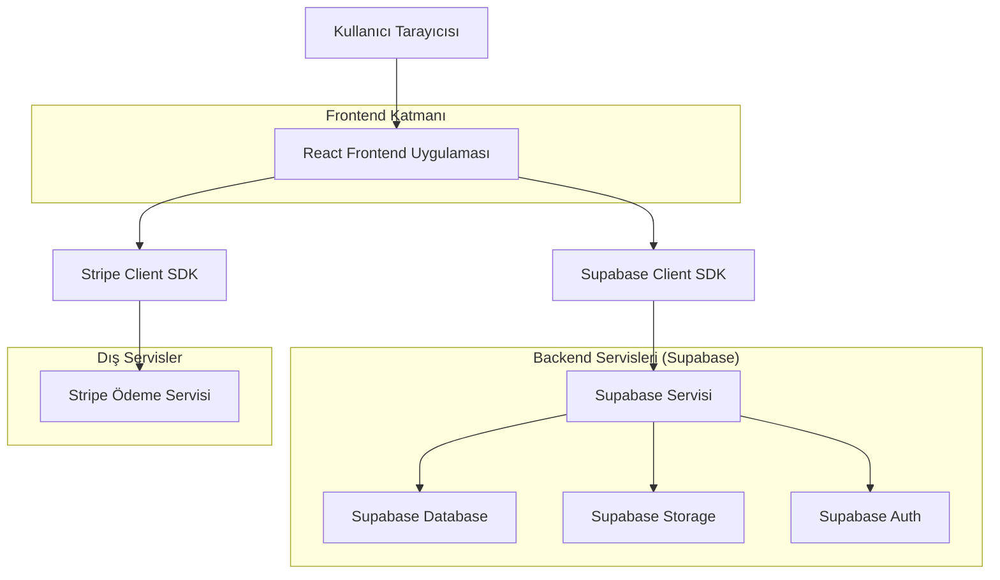
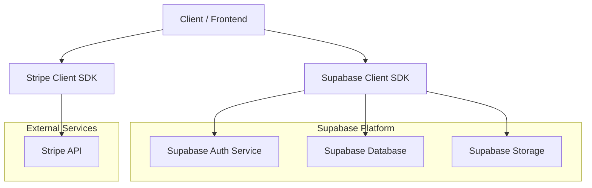
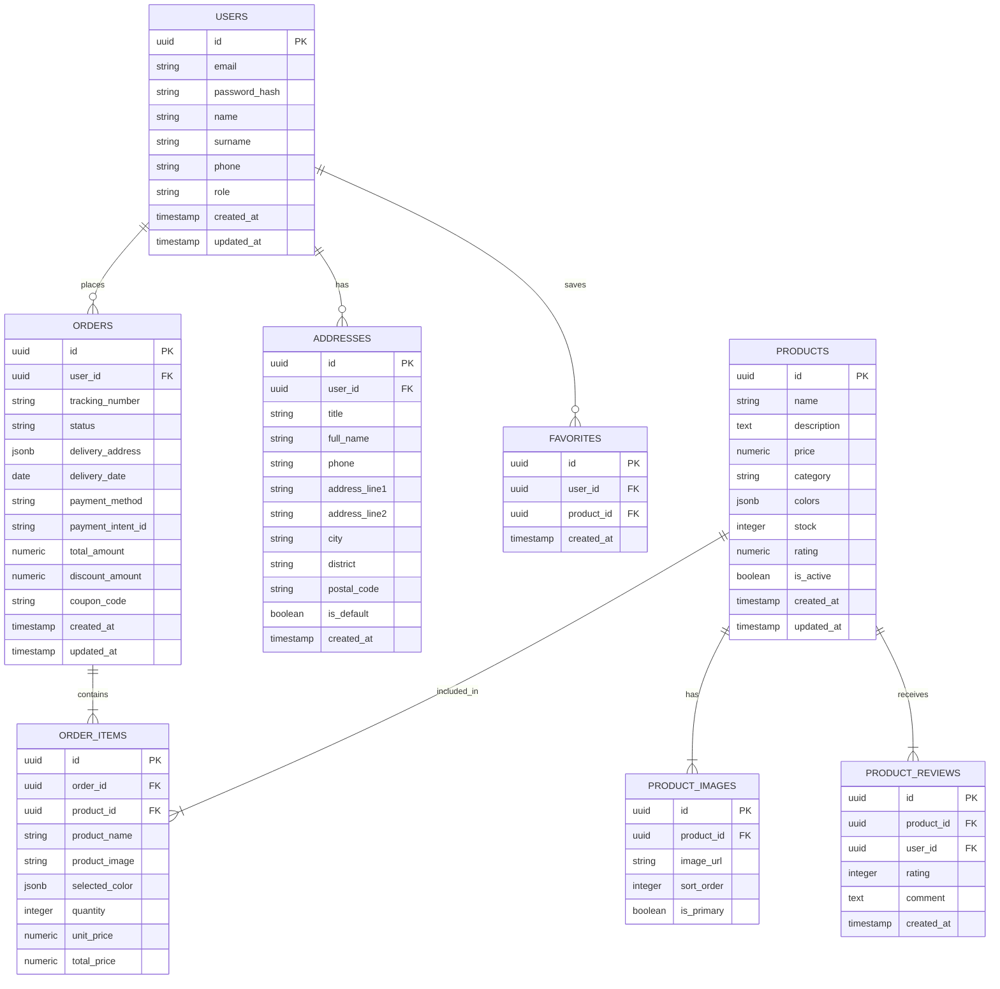

## 1.Architecture design



## 2.Technology Description
- Frontend: React@18 + Tailwind CSS@3 + Vite@5 + React Router@6
- Backend: Supabase (Auth, Database, Storage)
- Payment: Stripe@14 (Client-side Integration)
- Icons: Lucide React
- Forms: React Hook Form + Zod validation
- State Management: Zustand@4
- API Client: Axios
- SEO: React Helmet
- Date: Day.js

## 3.Route definitions
| Route | Purpose |
|-------|---------|
| / | Ana sayfa, hero banner, popüler ürünler, kategoriler, kampanyalar, Gift Finder, Reminder Widget |
| /catalog | Ürün kataloğu, filtreleme, arama, sıralama |
| /product/:id | Ürün detay sayfası, görseller, açıklama, varyasyonlar, medya mesajı ekleme |
| /cart | Sepet sayfası, ürün listesi, miktar kontrolü, özet hesaplama |
| /checkout | Ödeme sayfası, teslimat bilgileri, medya mesajı yükleme, görsel doğrulama seçeneği, ödeme yöntemi, sipariş özeti |
| /checkout/success | Başarılı ödeme sayfası, sipariş onayı, takip numarası |
| /login | Giriş sayfası, e-posta/şifre ile giriş, sosyal medya ile giriş |
| /register | Kayıt sayfası, yeni kullanıcı kaydı |
| /profile | Kullanıcı hesabı, profil bilgileri, ayarlar |
| /profile/orders | Sipariş geçmişi, detay görüntüleme, görsel doğrulama fotoğrafları |
| /profile/addresses | Adres yönetimi, ekleme/düzenleme |
| /profile/favorites | Favori ürünler listesi |
| /profile/reminders | Reminder sistemi, özel günler takvimi, hatırlatma ayarları |
| /profile/media-messages | Medya mesajları geçmişi, video/ses/resim görüntüleme |
| /order/:id | Sipariş takibi sayfası, durum görüntüleme, görsel doğrulama, medya mesajı |
| /contact | İletişim sayfası, form, harita, sosyal medya, WhatsApp canlı destek |
| /gift-finder | Gift Finder sayfası, akıllı çiçek önerileri |
| /admin | Admin paneli dashboard |
| /admin/products | Ürün yönetimi, ekleme/düzenleme/silme |
| /admin/orders | Sipariş yönetimi, durum güncelleme, görsel doğrulama yükleme |
| /admin/stock | Stok takibi, envanter yönetimi |
| /admin/users | Kullanıcı yönetimi, rol atama |
| /admin/reminders | Reminder sistemi yönetimi, hatırlatma ayarları |
| /admin/visual-verification | Görsel doğrulama sistemi yönetimi |

## 4.API definitions

### 4.1 Core API (Supabase)

#### Ürünler
```
GET /products
```
Query Parameters:
| Param Name | Param Type | isRequired | Description |
|------------|-----------|------------|-------------|
| category | string | false | Kategori filtresi (gul, lilyum, orkide, etc.) |
| min_price | number | false | Minimum fiyat |
| max_price | number | false | Maksimum fiyat |
| color | string | false | Renk filtresi |
| search | string | false | Arama kelimesi |
| sort_by | string | false | Sıralama (price_asc, price_desc, popular, new) |
| page | number | false | Sayfa numarası |
| limit | number | false | Sayfa başına ürün sayısı |

```
GET /products/:id
```
Response:
| Param Name | Param Type | Description |
|------------|-----------|-------------|
| id | UUID | Ürün benzersiz kimliği |
| name | string | Ürün adı |
| description | text | Ürün açıklaması |
| price | number | Ürün fiyatı |
| category | string | Ürün kategorisi |
| colors | array[] | Renk seçenekleri |
| images | array[] | Ürün görselleri URL |
| stock | number | Stok durumu |
| rating | number | Değerlendirme puanı |
| created_at | timestamp | Oluşturulma tarihi |

#### Siparişler
```
POST /orders
```
Request:
| Param Name | Param Type | isRequired | Description |
|------------|-----------|------------|-------------|
| user_id | UUID | true | Kullanıcı kimliği (guest için null) |
| items | array[] | true | Sipariş ürünleri |
| delivery_address | object | true | Teslimat adresi |
| delivery_date | string | true | Teslimat tarihi |
| payment_method | string | true | Ödeme yöntemi |
| payment_intent_id | string | true | Stripe payment intent ID |

Response:
| Param Name | Param Type | Description |
|------------|-----------|-------------|
| id | UUID | Sipariş kimliği |
| tracking_number | string | Takip numarası |
| status | string | Sipariş durumu |
| total_amount | number | Toplam tutar |
| created_at | timestamp | Oluşturulma tarihi |

```
GET /orders/:id
```
Response:
| Param Name | Param Type | Description |
|------------|-----------|-------------|
| id | UUID | Sipariş kimliği |
| user_id | UUID | Kullanıcı kimliği |
| items | array[] | Sipariş ürünleri |
| status | string | Sipariş durumu (pending, preparing, shipped, delivered) |
| delivery_address | object | Teslimat adresi |
| delivery_date | string | Teslimat tarihi |
| payment_method | string | Ödeme yöntemi |
| total_amount | number | Toplam tutar |
| tracking_number | string | Takip numarası |
| created_at | timestamp | Oluşturulma tarihi |

#### Kullanıcılar
```
POST /auth/register
```
Request:
| Param Name | Param Type | isRequired | Description |
|------------|-----------|------------|-------------|
| email | string | true | E-posta adresi |
| password | string | true | Şifre |
| name | string | true | Ad |
| surname | string | true | Soyad |
| phone | string | true | Telefon numarası |

Response:
| Param Name | Param Type | Description |
|------------|-----------|-------------|
| user | object | Kullanıcı bilgileri |
| session | object | Oturum bilgileri |

```
POST /auth/login
```
Request:
| Param Name | Param Type | isRequired | Description |
|------------|-----------|------------|-------------|
| email | string | true | E-posta adresi |
| password | string | true | Şifre |

Response:
| Param Name | Param Type | Description |
|------------|-----------|-------------|
| user | object | Kullanıcı bilgileri |
| session | object | Oturum bilgileri |

```
GET /user/profile
```
Response:
| Param Name | Param Type | Description |
|------------|-----------|-------------|
| id | UUID | Kullanıcı kimliği |
| email | string | E-posta adresi |
| name | string | Ad |
| surname | string | Soyad |
| phone | string | Telefon numarası |
| addresses | array[] | Kayıtlı adresler |
| created_at | timestamp | Kayıt tarihi |

### 4.2 Stripe Payment API

#### Payment Intent
```
POST /create-payment-intent
```
Request:
| Param Name | Param Type | isRequired | Description |
|------------|-----------|------------|-------------|
| amount | number | true | Ödeme tutarı (cent cinsinden) |
| currency | string | true | Para birimi (TRY) |
| metadata | object | false | Sipariş bilgileri |

Response:
| Param Name | Param Type | Description |
|------------|-----------|-------------|
| client_secret | string | Stripe client secret |
| payment_intent_id | string | Payment intent kimliği |

## 5.Server architecture diagram



## 6.Data model

### 6.1 Data model definition


### 6.2 Data Definition Language
```
-- create users table
CREATE TABLE users (
    id UUID PRIMARY KEY DEFAULT gen_random_uuid(),
    email VARCHAR(255) UNIQUE NOT NULL,
    password_hash VARCHAR(255) NOT NULL,
    name VARCHAR(100) NOT NULL,
    surname VARCHAR(100) NOT NULL,
    phone VARCHAR(20),
    role VARCHAR(20) DEFAULT 'customer' CHECK (role IN ('customer', 'admin')),
    created_at TIMESTAMP WITH TIME ZONE DEFAULT NOW(),
    updated_at TIMESTAMP WITH TIME ZONE DEFAULT NOW()
);

-- create addresses table
CREATE TABLE addresses (
    id UUID PRIMARY KEY DEFAULT gen_random_uuid(),
    user_id UUID REFERENCES users(id) ON DELETE CASCADE,
    title VARCHAR(50),
    full_name VARCHAR(200) NOT NULL,
    phone VARCHAR(20) NOT NULL,
    address_line1 VARCHAR(255) NOT NULL,
    address_line2 VARCHAR(255),
    city VARCHAR(100) NOT NULL,
    district VARCHAR(100) NOT NULL,
    postal_code VARCHAR(10),
    is_default BOOLEAN DEFAULT false,
    created_at TIMESTAMP WITH TIME ZONE DEFAULT NOW()
);

-- create products table
CREATE TABLE products (
    id UUID PRIMARY KEY DEFAULT gen_random_uuid(),
    name VARCHAR(255) NOT NULL,
    description TEXT,
    price DECIMAL(10, 2) NOT NULL,
    category VARCHAR(50) NOT NULL CHECK (category IN ('gul', 'lilyum', 'orkide', 'karisik', 'ozel_gun', 'aranjman', 'saksi', 'mevsimlik')),
    colors JSONB DEFAULT '[]',
    stock INTEGER DEFAULT 0,
    rating DECIMAL(3, 2) DEFAULT 0,
    is_active BOOLEAN DEFAULT true,
    created_at TIMESTAMP WITH TIME ZONE DEFAULT NOW(),
    updated_at TIMESTAMP WITH TIME ZONE DEFAULT NOW()
);

-- create product_images table
CREATE TABLE product_images (
    id UUID PRIMARY KEY DEFAULT gen_random_uuid(),
    product_id UUID REFERENCES products(id) ON DELETE CASCADE,
    image_url TEXT NOT NULL,
    sort_order INTEGER DEFAULT 0,
    is_primary BOOLEAN DEFAULT false,
    UNIQUE(product_id, sort_order)
);

-- create orders table
CREATE TABLE orders (
    id UUID PRIMARY KEY DEFAULT gen_random_uuid(),
    user_id UUID REFERENCES users(id) ON DELETE SET NULL,
    tracking_number VARCHAR(50) UNIQUE,
    status VARCHAR(20) DEFAULT 'pending' CHECK (status IN ('pending', 'preparing', 'shipped', 'delivered', 'cancelled')),
    delivery_address JSONB NOT NULL,
    delivery_date DATE NOT NULL,
    payment_method VARCHAR(20) NOT NULL CHECK (payment_method IN ('credit_card', 'bank_transfer', 'cash_on_delivery')),
    payment_intent_id VARCHAR(255),
    total_amount DECIMAL(10, 2) NOT NULL,
    discount_amount DECIMAL(10, 2) DEFAULT 0,
    coupon_code VARCHAR(20),
    created_at TIMESTAMP WITH TIME ZONE DEFAULT NOW(),
    updated_at TIMESTAMP WITH TIME ZONE DEFAULT NOW()
);

-- create order_items table
CREATE TABLE order_items (
    id UUID PRIMARY KEY DEFAULT gen_random_uuid(),
    order_id UUID REFERENCES orders(id) ON DELETE CASCADE,
    product_id UUID REFERENCES products(id),
    product_name VARCHAR(255) NOT NULL,
    product_image TEXT,
    selected_color JSONB,
    quantity INTEGER NOT NULL CHECK (quantity > 0),
    unit_price DECIMAL(10, 2) NOT NULL,
    total_price DECIMAL(10, 2) NOT NULL
);

-- create favorites table
CREATE TABLE favorites (
    id UUID PRIMARY KEY DEFAULT gen_random_uuid(),
    user_id UUID REFERENCES users(id) ON DELETE CASCADE,
    product_id UUID REFERENCES products(id) ON DELETE CASCADE,
    created_at TIMESTAMP WITH TIME ZONE DEFAULT NOW(),
    UNIQUE(user_id, product_id)
);

-- create product_reviews table
CREATE TABLE product_reviews (
    id UUID PRIMARY KEY DEFAULT gen_random_uuid(),
    product_id UUID REFERENCES products(id) ON DELETE CASCADE,
    user_id UUID REFERENCES users(id) ON DELETE CASCADE,
    rating INTEGER NOT NULL CHECK (rating >= 1 AND rating <= 5),
    comment TEXT,
    created_at TIMESTAMP WITH TIME ZONE DEFAULT NOW(),
    UNIQUE(product_id, user_id)
);

-- create indexes
CREATE INDEX idx_products_category ON products(category);
CREATE INDEX idx_products_is_active ON products(is_active);
CREATE INDEX idx_products_price ON products(price);
CREATE INDEX idx_products_rating ON products(rating DESC);
CREATE INDEX idx_orders_user_id ON orders(user_id);
CREATE INDEX idx_orders_status ON orders(status);
CREATE INDEX idx_orders_created_at ON orders(created_at DESC);
CREATE INDEX idx_order_items_order_id ON order_items(order_id);
CREATE INDEX idx_favorites_user_id ON favorites(user_id);
CREATE INDEX idx_product_reviews_product_id ON product_reviews(product_id);

-- grant permissions
GRANT SELECT ON products TO anon;
GRANT SELECT ON product_images TO anon;
GRANT ALL PRIVILEGES ON products TO authenticated;
GRANT ALL PRIVILEGES ON product_images TO authenticated;
GRANT ALL PRIVILEGES ON users TO authenticated;
GRANT ALL PRIVILEGES ON addresses TO authenticated;
GRANT ALL PRIVILEGES ON orders TO authenticated;
GRANT ALL PRIVILEGES ON order_items TO authenticated;
GRANT ALL PRIVILEGES ON favorites TO authenticated;
GRANT ALL PRIVILEGES ON product_reviews TO authenticated;

-- insert initial data
INSERT INTO products (name, description, price, category, colors, stock, rating) VALUES
('Klasik Gül Buketi', '12 adet kırmızı gül ile hazırlanan romantik buket', 299.99, 'gul', '["red", "white"]', 50, 4.8),
('Elegan Lilyum Aranjmanı', 'Beyaz lilyumlar ve yeşil yapraklar', 349.99, 'lilyum', '["white", "pink"]', 30, 4.7),
('Mor Orkide Saksısı', 'Kaliteli mor orkide, 3 sap', 199.99, 'orkide', '["purple", "white"]', 25, 4.9),
('Mevsimlik Çiçek Buketi', 'Mevsimin en güzel çiçekleriyle karışık buket', 249.99, 'karisik', '["mixed"]', 40, 4.6),
('Doğum Günü Özel', 'Renkli ve neşeli doğum günü çiçek aranjmanı', 399.99, 'ozel_gun', '["colorful"]', 20, 4.5);
